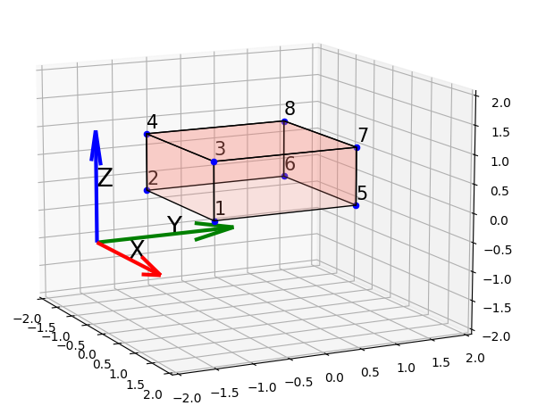

##
# py_drone: Ploting examples

Here is some explanation of how to represent geometric figures in 3d space.

## Table of contest

- [Cuboid](#cuboid)
    - [Vertex numeration](#vertex-numeration-cuboid)
    - [Plot](#plot-cuboid)
    - [Code example](#code-example-cuboid)
- [Hexagonal prism](#hexagonal-prism)
    - [Vertex numeration](#vertex-numeration-hexagonal-prism)
    - [Plot](#plot-hexagonal-prism)
    - [Code example](#code-example-hexagonal-prism)
# Cuboid
Here is global explanation
 
## Vertex numeration (cuboid)
LOREM IPSUM SRATA SATAT AS JAGJGSODSF KA
LOREM IPSUM SRATA SATAT AS JAGJGSODSF KA
LOREM IPSUM SRATA SATAT AS JAGJGSODSF KA
LOREM IPSUM SRATA SATAT AS JAGJGSODSF KA

LOREM IPSUM SRATA SATAT AS JAGJGSODSF KA
LOREM IPSUM SRATA SATAT AS JAGJGSODSF KA
LOREM IPSUM SRATA SATAT AS JAGJGSODSF KA
LOREM IPSUM SRATA SATAT AS JAGJGSODSF KA
LOREM IPSUM SRATA SATAT AS JAGJGSODSF KA
## Plot  (cuboid)
LOREM IPSUM SRATA SATAT AS JAGJGSODSF KA
LOREM IPSUM SRATA SATAT AS JAGJGSODSF KA
LOREM IPSUM SRATA SATAT AS JAGJGSODSF KA
LOREM IPSUM SRATA SATAT AS JAGJGSODSF KA
LOREM IPSUM SRATA SATAT AS JAGJGSODSF KA
LOREM IPSUM SRATA SATAT AS JAGJGSODSF KA
LOREM IPSUM SRATA SATAT AS JAGJGSODSF KA
LOREM IPSUM SRATA SATAT AS JAGJGSODSF KA
LOREM IPSUM SRATA SATAT AS JAGJGSODSF KA
## Code example  (cuboid)
LOREM IPSUM SRATA SATAT AS JAGJGSODSF KA
LOREM IPSUM SRATA SATAT AS JAGJGSODSF KA
LOREM IPSUM SRATA SATAT AS JAGJGSODSF KA
LOREM IPSUM SRATA SATAT AS JAGJGSODSF KA
LOREM IPSUM SRATA SATAT AS JAGJGSODSF KA
LOREM IPSUM SRATA SATAT AS JAGJGSODSF KA
LOREM IPSUM SRATA SATAT AS JAGJGSODSF KA
LOREM IPSUM SRATA SATAT AS JAGJGSODSF KA
LOREM IPSUM SRATA SATAT AS JAGJGSODSF KA

# Hexagonal prism

## Vertex numeration (hexagonal prism)

## Plot (hexagonal prism)
LOREM IPSUM SRATA SATAT AS JAGJGSODSF KA
LOREM IPSUM SRATA SATAT AS JAGJGSODSF KA
LOREM IPSUM SRATA SATAT AS JAGJGSODSF KA
LOREM IPSUM SRATA SATAT AS JAGJGSODSF KA
LOREM IPSUM SRATA SATAT AS JAGJGSODSF KA
LOREM IPSUM SRATA SATAT AS JAGJGSODSF KA
LOREM IPSUM SRATA SATAT AS JAGJGSODSF KA
LOREM IPSUM SRATA SATAT AS JAGJGSODSF KA
LOREM IPSUM SRATA SATAT AS JAGJGSODSF KA
## Code example (hexagonal prism)